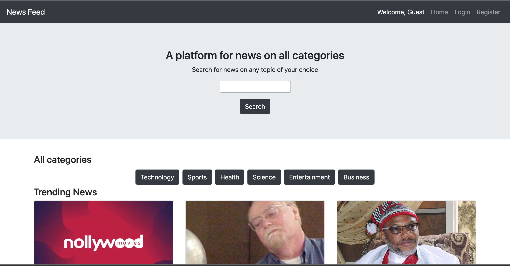
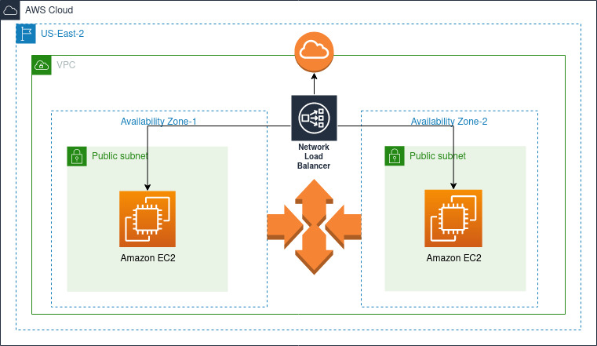

# NewsFeed

# Introduction
The NewsFeed website is a personal project i worked on. It's a fullstack website that consumes news from a news API and shows the data in the frontend. There is also an authentication feature that allows users to sign up and saves user's data to an sqlite database.

# Deployment
The website is deployed on AWS. It runs on EC2 instances as part of an auto scaling group. Here is the URL (will be taken down soon) [link](news-feed-load-balancer-49b43ec3921a6792.elb.us-east-2.amazonaws.com). Now let's take a high level overview of our infrastructure architecture diagram.

We setup a VPC in our AWS account with 2 subnets. Then we create an auto-scaling group that spans multiple availability zones. We setup the auto-scaling group to ensure that our app scales as needed in response to the load on the servers. We attatch an Internet Gatewa to ensure our apps have a way to access the internet and we have a route table as well that routes traffic within the VPC.
